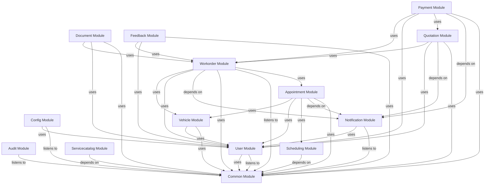

# APU-ASC System Architecture & Modulith Overview

This documentation is **100% auto-generated** from Spring Modulith architectural analysis.

## 🌐 Global Architecture Map

## 📦 Domain Modules Index
| Domain Module | Architecture Diagram & Specification |
|---|---|
| **APPOINTMENT** | [View appointment Specs & Diagram](./module-appointment.md) |
| **AUDIT** | [View audit Specs & Diagram](./module-audit.md) |
| **COMMON** | [View common Specs & Diagram](./module-common.md) |
| **CONFIG** | [View config Specs & Diagram](./module-config.md) |
| **DOCUMENT** | [View document Specs & Diagram](./module-document.md) |
| **FEEDBACK** | [View feedback Specs & Diagram](./module-feedback.md) |
| **NOTIFICATION** | [View notification Specs & Diagram](./module-notification.md) |
| **PAYMENT** | [View payment Specs & Diagram](./module-payment.md) |
| **QUOTATION** | [View quotation Specs & Diagram](./module-quotation.md) |
| **SCHEDULING** | [View scheduling Specs & Diagram](./module-scheduling.md) |
| **SERVICECATALOG** | [View servicecatalog Specs & Diagram](./module-servicecatalog.md) |
| **USER** | [View user Specs & Diagram](./module-user.md) |
| **VEHICLE** | [View vehicle Specs & Diagram](./module-vehicle.md) |
| **WORKORDER** | [View workorder Specs & Diagram](./module-workorder.md) |

---
> Update these documents anytime by running `./manage.sh docs`.