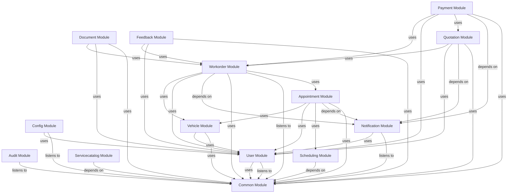

# System Architecture
## Visual Architecture Diagram

```mermaid
flowchart TD
    Appointment["Appointment Module"]
    Audit["Audit Module"]
    Common["Common Module"]
    Config["Config Module"]
    Document["Document Module"]
    Feedback["Feedback Module"]
    Notification["Notification Module"]
    Payment["Payment Module"]
    Quotation["Quotation Module"]
    Scheduling["Scheduling Module"]
    Servicecatalog["Servicecatalog Module"]
    User["User Module"]
    Vehicle["Vehicle Module"]
    Workorder["Workorder Module"]
    Appointment -->|uses| Common
    Appointment -->|depends on| Notification
    Appointment -->|uses| Scheduling
    Appointment -->|uses| User
    Appointment -->|uses| Vehicle
    Audit -->|listens to| Common
    Config -->|listens to| Common
    Config -->|uses| User
    Document -->|uses| Common
    Document -->|uses| User
    Document -->|uses| Workorder
    Feedback -->|uses| Common
    Feedback -->|uses| User
    Feedback -->|uses| Workorder
    Notification -->|listens to| Common
    Notification -->|uses| User
    Payment -->|uses| Common
    Payment -->|depends on| Notification
    Payment -->|uses| Quotation
    Payment -->|uses| User
    Payment -->|uses| Workorder
    Quotation -->|uses| Common
    Quotation -->|depends on| Notification
    Quotation -->|uses| User
    Quotation -->|uses| Workorder
    Scheduling -->|depends on| Common
    Servicecatalog -->|depends on| Common
    User -->|listens to| Common
    User -->|uses| Common
    Vehicle -->|uses| Common
    Vehicle -->|uses| User
    Workorder -->|uses| Appointment
    Workorder -->|listens to| Common
    Workorder -->|uses| Common
    Workorder -->|depends on| Notification
    Workorder -->|uses| User
    Workorder -->|uses| Vehicle
```
> Auto-generated from `docs/diagrams/puml/components.puml`.