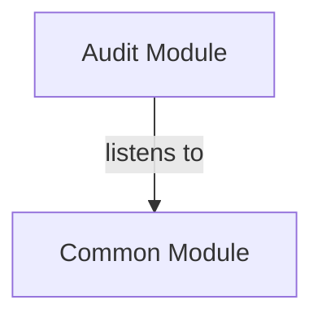

# AUDIT Module
## Visual Architecture Diagram

## Module Specifications & Boundaries
| Specification / Property | Details |
|---|---|
| **Base package** | `com.apu.asc.audit` |
| **Spring components** | **Services** • `c.a.a.a.AuditLogApi` (via `c.a.a.a.internal.AuditLogServiceImpl`) |
| **Events listened to** | • `c.a.a.c.event.AuditEvent` |
> Auto-generated from `docs/diagrams/puml/module-audit.puml` and `docs/diagrams/canvases/module-audit.adoc`.