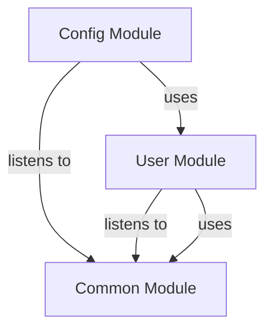

# CONFIG Module
## Visual Architecture Diagram

## Module Specifications & Boundaries
| Specification / Property | Details |
|---|---|
| **Base package** | `com.apu.asc.config` |
| **Spring components** | **Controllers** • `c.a.a.c.ScalarUiController` • `c.a.a.c.SseController` listening to `c.a.a.c.event.LiveUpdateEvent` **Others** • `c.a.a.c.AppConfig` • `c.a.a.c.CacheConfig` • `c.a.a.c.HttpLoggingFilter` • `c.a.a.c.RateLimiterFilter` • `c.a.a.c.ScalarDocConfig` • `c.a.a.c.SecurityConfig` |
| **Bean references** | • `c.a.a.u.CustomOidcUserService` (in User) • `c.a.a.u.CurrentUserService` (in User) |
| **Events listened to** | • `c.a.a.c.event.LiveUpdateEvent` |
> Auto-generated from `docs/diagrams/puml/module-config.puml` and `docs/diagrams/canvases/module-config.adoc`.