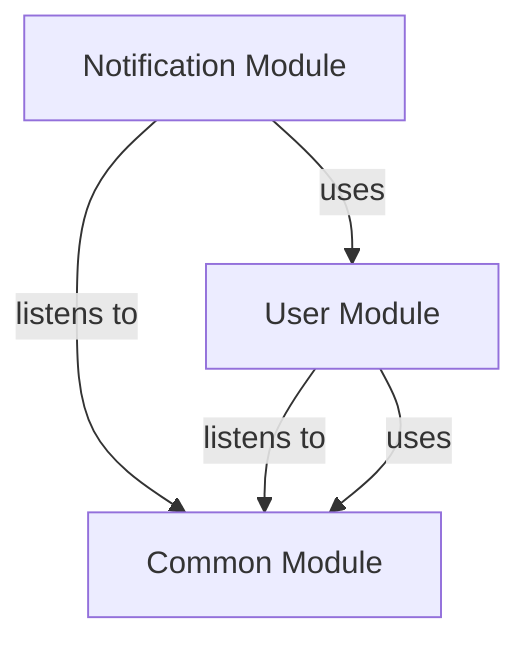

# NOTIFICATION Module
## Visual Architecture Diagram

## Module Specifications & Boundaries
| Specification / Property | Details |
|---|---|
| **Base package** | `com.apu.asc.notification` |
| **Spring components** | **Services** • `c.a.a.n.NotificationApi` (via `c.a.a.n.internal.NotificationServiceImpl`) |
| **Bean references** | • `c.a.a.u.CurrentUserService` (in User) • `c.a.a.u.UserApi` (in User) |
| **Events listened to** | • `c.a.a.c.event.AppointmentReminderRequestedEvent` |
> Auto-generated from `docs/diagrams/puml/module-notification.puml` and `docs/diagrams/canvases/module-notification.adoc`.