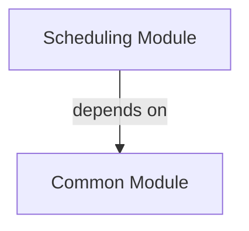

# SCHEDULING Module
## Visual Architecture Diagram

## Module Specifications & Boundaries
| Specification / Property | Details |
|---|---|
| **Base package** | `com.apu.asc.scheduling` |
| **Spring components** | **Services** • `c.a.a.s.SchedulingApi` (via `c.a.a.s.internal.SchedulingServiceImpl`) |
> Auto-generated from `docs/diagrams/puml/module-scheduling.puml` and `docs/diagrams/canvases/module-scheduling.adoc`.