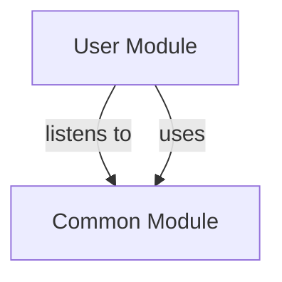

# USER Module
## Visual Architecture Diagram

## Module Specifications & Boundaries
| Specification / Property | Details |
|---|---|
| **Base package** | `com.apu.asc.user` |
| **Spring components** | **Services** • `c.a.a.u.CurrentUserService` • `c.a.a.u.CustomOidcUserService` • `c.a.a.u.UserApi` (via `c.a.a.u.internal.UserServiceImpl`) |
| **Bean references** | • `c.a.a.c.security.AccessPolicy` (in Common) |
| **Events listened to** | • `c.a.a.c.event.AppointmentReminderRequestedEvent` • `c.a.a.c.event.EmployeeInvitationRequestedEvent` |
> Auto-generated from `docs/diagrams/puml/module-user.puml` and `docs/diagrams/canvases/module-user.adoc`.