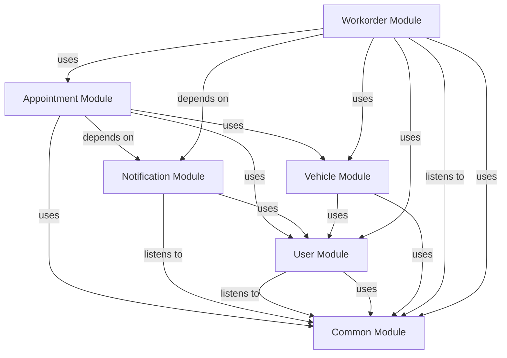

# WORKORDER Module
## Visual Architecture Diagram

## Module Specifications & Boundaries
| Specification / Property | Details |
|---|---|
| **Base package** | `com.apu.asc.workorder` |
| **Spring components** | **Services** • `c.a.a.w.WorkOrderApi` (via `c.a.a.w.internal.WorkOrderServiceImpl`) |
| **Bean references** | • `c.a.a.a.AppointmentApi` (in Appointment) • `c.a.a.v.VehicleApi` (in Vehicle) • `c.a.a.u.UserApi` (in User) • `c.a.a.u.CurrentUserService` (in User) • `c.a.a.c.security.AccessPolicy` (in Common) |
| **Events listened to** | • `c.a.a.c.event.QuotationApprovedEvent` |
> Auto-generated from `docs/diagrams/puml/module-workorder.puml` and `docs/diagrams/canvases/module-workorder.adoc`.